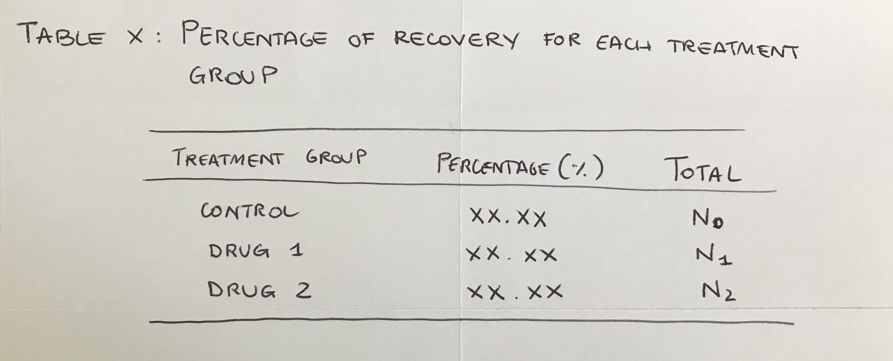

# Instructions

Divide your team in 2 sub-teams: sub-team 1 will work on descriptive results, sub-team 2 on inferential results. 

Dedicate 5 minutes to Part 1 and 3 minutes to Part 2.

## Part 1

### Sub-team 1

Imagine a visualization (table or plot) that you would use to summarize your **descriptive** results. Describe how it looks like and what it shows.

-   Sketch this visualization on a paper. Write a caption for it. 

- If you have time left, take a picture of your sketch with caption and over-write the file `figures/results-descriptive.png`

### Sub-team 2

Imagine a visualization (table or plot) that you would use to summarize your **inferential** results. Sketch it on a paper. Describe how it looks like and what it shows.

-   Sketch this visualization on a paper. Write a caption for it. 

- If you have time left, take a picture of your sketch with caption and over-write the file `figures/results-inferential.png`

## Part 2

1.  Sub-team 1: show your work to Sub-team 2. Sub-team 2, comment:
  
  - Is the figures/table proposed appropriate for the data being discussed? 
  
  - Is the figure/table caption and/or legend clear and concise?

2.  Sub-team 2: show your work to Sub-team 1. Sub-team 1, comment:
  
  - Is the figures/table proposed appropriate for your research questions? 
  
  - Is the figure/table caption and/or legend clear and concise?
  
